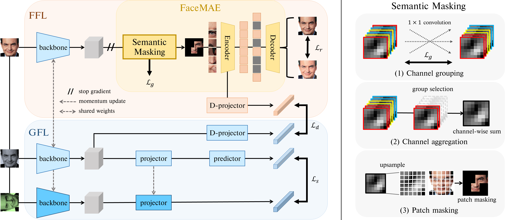

## SimFLE: Simple Facial Landmark Encoding for Self-Supervised Facial Expression Recognition in the Wild

This is a PyTorch implementation of the SimFLE paper:  
[arXiv](https://arxiv.org/abs/2303.07648)

## Abstract

One of the key issues in facial expression recognition in the wild (FER-W) is that curating large-scale labeled facial images is challenging due to the inherent complexity and ambiguity of facial images. Therefore, in this paper, we propose a self-supervised simple facial landmark encoding (SimFLE) method that can learn effective encoding of facial landmarks, which are important features for improving the performance of FER-W, without expensive labels. Specifically, we introduce novel FaceMAE module for this purpose. FaceMAE reconstructs masked facial images with elaborately designed semantic masking. Unlike previous random masking, semantic masking is conducted based on channel information processed in the backbone, so rich semantics of channels can be explored. Additionally, the semantic masking process is fully trainable, enabling FaceMAE to guide the backbone to learn spatial details and contextual properties of fine-grained facial landmarks. Experimental results on several FER-W benchmarks prove that the proposed SimFLE is superior in facial landmark localization and noticeably improved performance compared to the supervised baseline and other self-supervised methods.

<p align="center">
    
</p>

## Citation

If you use this for research, please cite. Here is an example BibTeX entry:

```
@misc{moon2023simfle,
      title={SimFLE: Simple Facial Landmark Encoding for Self-Supervised Facial Expression Recognition in the Wild}, 
      author={Jiyong Moon and Seongsik Park},
      year={2023},
      eprint={2303.07648},
      archivePrefix={arXiv},
      primaryClass={cs.CV}
}
```
