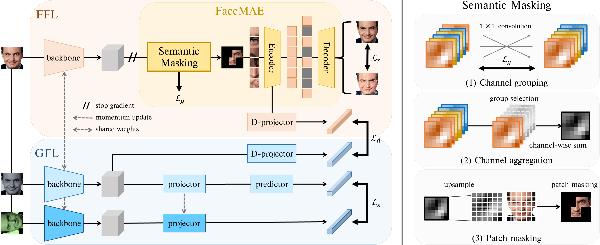

# SimFLE for Self-Supervised FER-W
This is a PyTorch implementation of the paper "***SimFLE: Simple Facial Landmark Encoding for Self-Supervised Facial Expression Recognition in the Wild***"<br>

[arXiv](https://arxiv.org/abs/2303.07648)

## Abstract
One of the key issues in facial expression recognition in the wild (FER-W) is that curating large-scale labeled facial images is challenging due to the inherent complexity and ambiguity of facial images. Therefore, in this paper, we propose a self-supervised simple facial landmark encoding (SimFLE) method that can learn effective encoding of facial landmarks, which are important features for improving the performance of FER-W, without expensive labels. Specifically, we introduce novel FaceMAE module for this purpose. FaceMAE reconstructs masked facial images with elaborately designed semantic masking. Unlike previous random masking, semantic masking is conducted based on channel information processed in the backbone, so rich semantics of channels can be explored. Additionally, the semantic masking process is fully trainable, enabling FaceMAE to guide the backbone to learn spatial details and contextual properties of fine-grained facial landmarks. Experimental results on several FER-W benchmarks prove that the proposed SimFLE is superior in facial landmark localization and noticeably improved performance compared to the supervised baseline and other self-supervised methods.

<p align="center">
    
</p>

## Data Preparation
In the paper, we use data from 4 publicly available datasets:

+ [AffectNet](http://mohammadmahoor.com/affectnet/)
+ [RAF-DB](http://www.whdeng.cn/raf/model1.html#dataset)
+ [FERPlus](https://github.com/microsoft/FERPlus)
+ [SFEW](https://cs.anu.edu.au/few/AFEW.html)

Please download them from the official websites and put them in the corresponding folders.

Data for SimFLE training should be structured as follows:
``` sh
|-PATH/TO/DATASET
 |-img1.jpg
 |-img2.jpg
 |-img3.jpg
 |-img4.jpg
 |-...
```

Data for linear probing should be structured as follows:
``` sh
|-PATH/TO/DATASET
 |-train
 | |-class1
 | | |-img1.jpg
 | | |-img2.jpg
 | | |-...
 | |-class2
 | | |-img3.jpg
 | | |-img4.jpg
 | | |-...
 |-val
 | |-class1
 | | |-img5.jpg
 | | |-img6.jpg
 | | |-...
 | |-class2
 | | |-img7.jpg
 | | |-img8.jpg
 | | |-...
```

## Usage
An example command line for the SimFLE training:
```bash
python main_simfle.py --data-path {PATH/TO/DATASET} --n-gpus {NUM_GPUS}
```

An example command line for the linear probing:
```bash
python main_linear.py --data-path {PATH/TO/DATASET} --dataset {DATASET_NAME} --pretrained {PATH/TO/PRETRAINED_MODEL} --n-gpus {NUM_GPUS}
```

An example command line only for the test:
```bash
python main_linear.py --data-path {PATH/TO/DATASET} --dataset {DATASET_NAME} --pretrained {PATH/TO/TRAINED_MODEL} --n-gpus {NUM_GPUS} --eval
```

## References
Parts of our codes based on:
* [facebookresearch/mae](https://github.com/facebookresearch/mae)
* [researchmm/DBTNet](https://github.com/researchmm/DBTNet)

## Citation
If you use this for research, please cite. Here is an example BibTeX entry:

```
@article{moon2023simfle,
  title={SimFLE: Simple Facial Landmark Encoding for Self-Supervised Facial Expression Recognition in the Wild},
  author={Moon, Jiyong and Park, Seongsik},
  journal={arXiv preprint arXiv:2303.07648},
  year={2023}
}
```

## Contact
If you have any questions about codes, please contact us by asdwldyd123@gmail.com.
